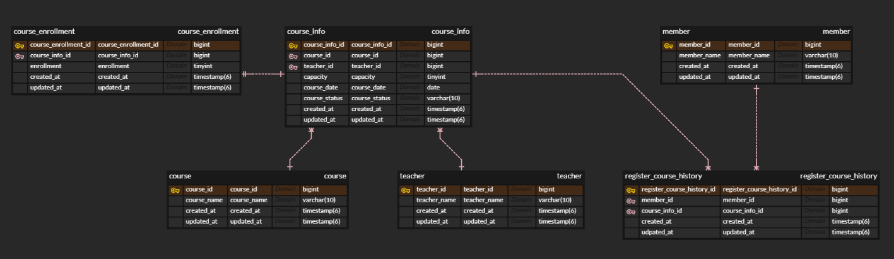

# ERD


```sql
CREATE TABLE `member` (
    `member_id` bigint NOT NULL,
    `member_name` varchar(10) NOT NULL,
    `created_at` timestamp(6) NULL,
    `updated_at` timestamp(6) NULL,
    CONSTRAINT `PK_MEMBER` PRIMARY KEY (`member_id`)
);

CREATE TABLE `teacher` (
    `teacher_id` bigint NOT NULL,
    `teacher_name` varchar(10) NOT NULL,
    `created_at` timestamp(6) NULL,
    `updated_at` timestamp(6) NULL,
    CONSTRAINT `PK_TEACHER` PRIMARY KEY (`teacher_id`)
);

CREATE TABLE `course` (
    `course_id` bigint NOT NULL,
    `course_name` varchar(10) NOT NULL,
    `created_at` timestamp(6) NULL,
    `updated_at` timestamp(6) NULL,
    CONSTRAINT `PK_COURSE` PRIMARY KEY (`course_id`)
);

CREATE TABLE `course_info` (
    `course_info_id` bigint NOT NULL,
    `course_id` bigint NOT NULL,
    `teacher_id` bigint NOT NULL,
    `capacity` tinyint NOT NULL,
    `course_date` date NOT NULL,
    `course_status` varchar(10) NOT NULL,
    `created_at` timestamp(6) NULL,
    `updated_at` timestamp(6) NULL,
    CONSTRAINT `PK_COURSE_INFO` PRIMARY KEY (`course_info_id`),
    CONSTRAINT `FK_COURSE_INFO_COURSE` FOREIGN KEY (`course_id`) REFERENCES `course` (`course_id`),
    CONSTRAINT `FK_COURSE_INFO_TEACHER` FOREIGN KEY (`teacher_id`) REFERENCES `teacher` (`teacher_id`)
);

CREATE TABLE `course_enrollment` (
    `course_enrollment_id` bigint NOT NULL,
    `course_info_id` bigint NOT NULL,
    `enrollment` tinyint NOT NULL,
    `created_at` timestamp(6) NULL,
    `updated_at` timestamp(6) NULL,
    CONSTRAINT `PK_COURSE_ENROLLMENT` PRIMARY KEY (`course_enrollment_id`),
    CONSTRAINT `FK_COURSE_ENROLLMENT_COURSE_INFO` FOREIGN KEY (`course_info_id`) REFERENCES `course_info` (`course_info_id`)
);

CREATE TABLE `register_course_history` (
    `register_course_history_id` bigint NOT NULL,
    `member_id` bigint NOT NULL,
    `course_info_id` bigint NOT NULL,
    `created_at` timestamp(6) NULL,
    `updated_at` timestamp(6) NULL,
    CONSTRAINT `PK_REGISTER_COURSE_HISTORY` PRIMARY KEY (`register_course_history_id`),
    CONSTRAINT `FK_REGISTER_COURSE_HISTORY_MEMBER` FOREIGN KEY (`member_id`) REFERENCES `member` (`member_id`),
    CONSTRAINT `FK_REGISTER_COURSE_HISTORY_COURSE_INFO` FOREIGN KEY (`course_info_id`) REFERENCES `course_info` (`course_info_id`)
);
```

처음에는 간단하게만 생각해서 course, member, register_course_history 3개의 테이블로만 구성했었다.

모든 정보를 course에 담았었지만 다양한 조합과 하나의 수정이 여러개로 전파되는 걸 방지하기 위해 정규화를 진행했다.

 - 정규화 후 설계는 course, teacher, member는 id와 각각의 이름만 저장하고 course와 teacher, 그리고 course_info에 날짜를 조합해 여러가지 강의를 개설할 수 있게 개선했다.
 - 이 과정에서 동시성제어를 위해 비관적 락을 걸어야 하는 상황이 생겨 course_info에 현재 수강 인원을 관리하는 것 보다 course_enrollment 테이블로 현재 수강 인원을 관리하는 테이블을 따로 빼내어 이쪽에만 락을 걸게 불필요한 충돌은 줄이고 처리 속도 즉 성능을 높혔다.
 - 또한 course_info에 ststus를 두어 FULL / EMPTY로 상태를 저장시켜 수강인원이 다차면 status를 FULL로 바꾸고 비즈니스 로직에서 강좌 상태를 확인하는걸 추가해서 락을 걸기전에 검사를 하므로 불필요한 락을 피하는 식으로 개선했다.

## 번외
### 비관적 락과 낙관적 락
 - 비관적 락이란
   - 데이터 충돌이 자주 발생할 것이라는 전제를 가지고 데이터를 보호하는 방식
   - 트랜잭션이 데이터를 읽거나 쓸 때 다른 트랜잭션이 데이터를 수정하지 못하게 LOCK을 거는 방식
   - 장점은 충돌 가능성이 높은 경우 데이터를 안전하게 보호할 수 있다.
   - 단점은 성능 저하 발생할 수 있다 -> 락을 걸면 데이터에 대한 접근이 제한됨으로 처리 속도가 느려진다.
 - 낙관적 락이란
   - 데이터 충돌이 자주 발생하지 않을 것이라는 전제를 가지고 하는 방법
   - 트랜잭션이 락을 거는것이 아닌 데이터 수정 시점에서 충돌이 날것인이 여부를 확인
   - 주도 버전 관리 방식을 사용 -> 데이터를 수정할 때 버전 번호를 확인, 데이터가 수정될 때마다 버전 번호가 증가 -> 데이터를 수정할 때 읽은 버전과 현재 버전이 다르면 충돌이 발생한 것으로 간주
   - 장점은 락을 걸지 않기 때문에 처리 속도가 빠르다
   - 단점은 충돌이 자주 발생할 경우 혹은 버전 번호가 달라 무한 재요청을 할 경우가 생길 수 있다.

비관적 락을 걸었을 때 조회를 할수 있는가?
 - 앞서 비관적 락에서 데이터를 읽거나 쓸 대 다른 트랜잭션이 데이터를 읽거나 수정하지 못하게 LOCK을 거는 방식으로 소개를 했다.
 - 또한 JPA @Lock(LockModeType.PESSIMISTIC_WRITE)을 걸면 쓰기 락을 걸어 다른 트랜잭션이 읽거나 수정 할 수 없게 한다고 한다.

하지만 이것은 엄밀히 말하면 틀렸다고 볼 수있다.

왜냐하면 데이터베이스 트랜잭션 격리 수준에 따라 다르게 동작할 수 있기 때문이다.
 - READ UNCOMMITTED : 모든 트랜잭션이 다른 트랜잭션에서 커밋되지 않은 데이터에 접근이 가능
 - READ COMMITTED : 트랜잭션은 커밋된 데이터만 읽기가 가능 -> 비관적 락이 걸린 데이터에 대해 쓰기 작업은 차단되나 읽기는 가능
 - REPEATABLE READ : 트랜잭션이 처음 읽은 데이터를 끝까지 읽을 수 있도록 보장, 다른 트랜잭션의 쓰기 작업은 대기 -> 이 수준에서도 비관적 락이 걸린 데이터는 읽기가 가능
 - SERIALIZABLE : 가장 높은 격리 수준, 모든 트랜잭션이 서로 독립적으로 작동하게 보장 -> 이 격리 수준에서야 비관적 락이 걸린 데이터가 쓰기, 읽기 모두 제한

H2 데이터베이스는 기본 트랜잭션 격리 수준이 **READ COMMITTED**이다.

따라서 현재 어플리케이션의 비관적락은 다른 select문으로 읽기가 가능하다.
읽기도 대기를 하게 하려면 데이터베이스 트랜잭션 격리 수준을 **SERIALIZABLE**로 바꿔야 읽기와 쓰기가 모두 제한되는 비관적 락이 동작하게 된다.